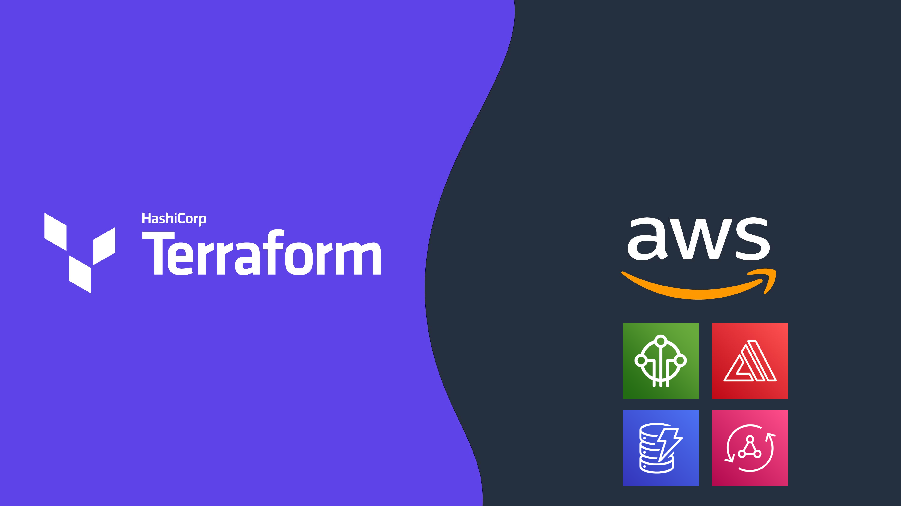

# Water is Life: Nigeria Project.
#### Core Contributors:
**[Kevon Mayers](https://www.linkedin.com/in/kevonmayers)** - Terraform deployment, AWS IoT Lead, Arduino Code Development

**[Michael J. Watkins](https://www.linkedin.com/in/adampurdie/)** - Black Box Hardware Development, Arduino Code Development

This project was created to help bring clean drinking water to a village in Nigeria, leveraging the power of AWS IoT. This project was made possible by collaboration with Amazon Web Services (AWS), WATERisLIFE, and Better Things, LLC.

TODO - Add Arch Diagram

To provide a streamlined and repeatable deployment, we are leveraging **[Terraform](https://www.terraform.io/)** for Infrastructure as Code (IaC).

To find out more about the project, see this [ChangeX Project](https://www.changex.org/us/project/waterislife).

